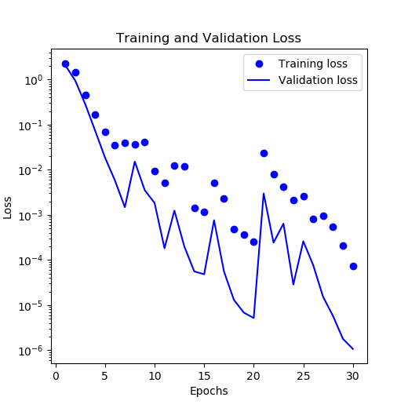
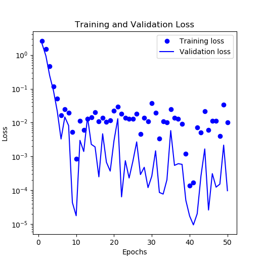
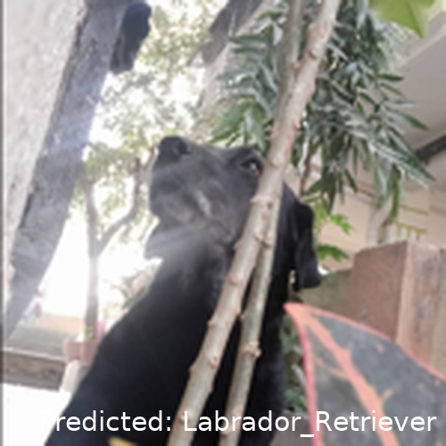
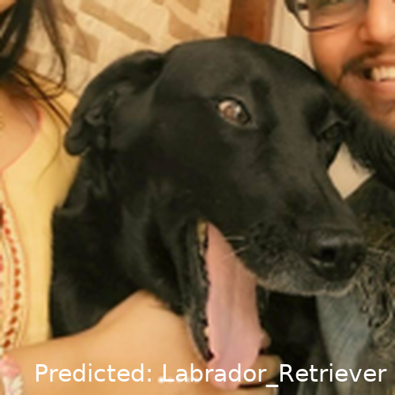
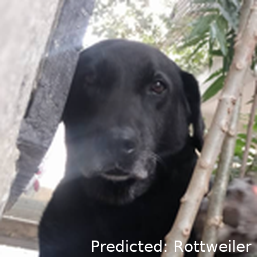
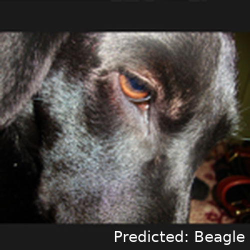
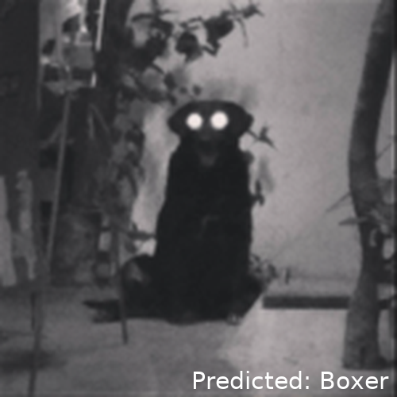

# Experimenting with CNN to classify dogs

In this repo I eperiment with a small dog image dataset from Kaggle. The data has 10 do breeds (classes) and each of the breeds has 100 images related to it. However, these are not 100 unique images for each breed! Each breed has some 10-15 unique images, which are then replicated to increase the dataset size. (Sidenote, this will be a ncie way to ramp-up the data size artificially as as to practice managing large datasets.)

## Neural Network Architecture

I have 10 layers of Convolutional Neural Network. Here is a brief overview

```
Model: "sequential_4"
_________________________________________________________________
 Layer (type)                Output Shape              Param #   
=================================================================
 conv2d_12 (Conv2D)          (None, 148, 148, 32)      896       
                                                                 
 max_pooling2d_12 (MaxPoolin  (None, 74, 74, 32)       0         
 g2D)                                                            
                                                                 
 conv2d_13 (Conv2D)          (None, 72, 72, 64)        18496     
                                                                 
 max_pooling2d_13 (MaxPoolin  (None, 36, 36, 64)       0         
 g2D)                                                            
                                                                 
 conv2d_14 (Conv2D)          (None, 34, 34, 128)       73856     
                                                                 
 max_pooling2d_14 (MaxPoolin  (None, 17, 17, 128)      0         
 g2D)                                                            
                                                                 
 flatten_4 (Flatten)         (None, 36992)             0         
                                                                 
 dense_8 (Dense)             (None, 512)               18940416  
                                                                 
 dropout_4 (Dropout)         (None, 512)               0         
                                                                 
 dense_9 (Dense)             (None, 10)                5130      
                                                                 
=================================================================
Total params: 19,038,794
Trainable params: 19,038,794
Non-trainable params: 0
_________________________________________________________________
```

# Results

The model performs qutie well. The validation loss is acceptable.

## 30 epochs


## 50 epochs


See some examples in `./MyGood_Predictions` to classify images from the original dataset.
Additionally, I was able to provide some of my own images to classify.
These are actual images of my dog that were not included in the training.

## Correct classification for unseen images
There were a lot of images that were clear, and I would say easy to classify.
However here are some examples, where there are obstacles, and yet the model is aboe to classify properly.




## Incorrect classification for unseen images
And here is another one with some obstacles and the model could not predict well.
I unfortunately do not have a lot of images with such obstacles to test and quantify.



## Difficult/Ambuguous images
I also provided some images that were of questionable quality (and obviously not present in the training dataset).



The shape of the ears in the next kinda make her look like a boxer, but I wouldn't blame the model to get this wrong.


